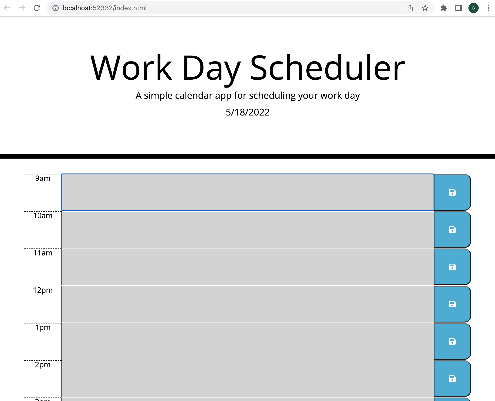

# Day Planner

# Table of Contents
• Description

•Navigation

•Screenshot of Site

• Links

• References

# Description

This app runs in the browser and lineaments dynamically updated HTML and designed eloquently by CSS.  This app is powered by javascript as well.

A simple calendar app for scheduling your work day

# Navigation
The user will be presented with the current date along with a title and short description.

Under the the top of the page on the left will be a times throughout the day. 

Next to the time will be a description box where the user can easily input any information they desire. (These boxes will change color based on past,present,future inputs.)

Once the user is happy with how their schedule is laid out on the page they can simply click the save icon all the way on the right hand side.

# Screenshot of site
<!-- add the right screenshot -->

# Links

<!-- add the correct link in the () -->

[Repo link](https://github.com/SarahAmel/day-planner)   

[Live link](https://sarahamel.github.io/day-planner/)

[Linkedin Link](https://www.linkedin.com/in/sarah-attar-477312235/)

# Contact
Email: sarahattar76@gmail.com

# References
The play back zoom videos from Unit 1-3.2 helped immensely.

The staff within the UCF bootcamp helped me tremendously.

I am greatly appreciative of all the knowlegeable Tutors available and TA's who helped after or before class.